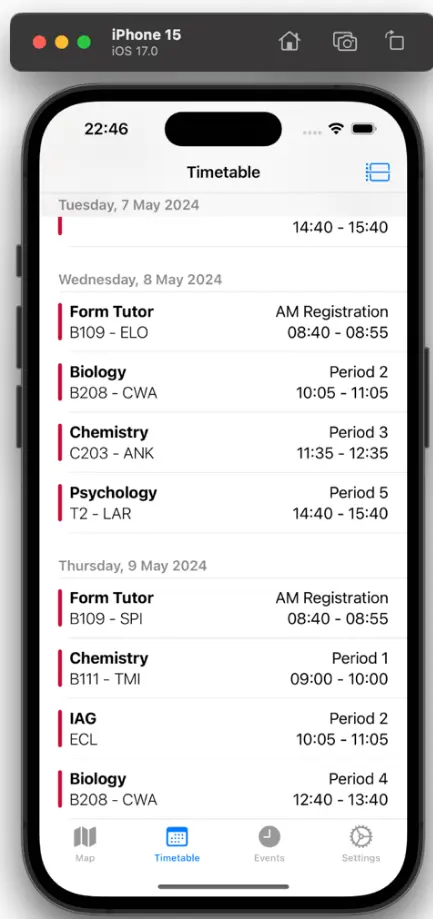

# Patesian: An iOS App for Pate's Grammar School

As a student at Pate's, I found myself navigating the campus with a paper map and texting screenshots of my timetable to coordinate with friends. I built Patesian as my final school programming project to create a modern, all-in-one solution that I wish I'd had.

This repository contains the source code for the native iOS application.

## Core Features & Technology

The app was built natively for iOS using Swift and SwiftUI, focusing on a responsive and intuitive user experience.

* **Interactive Campus Map:** Provides a live map of the school grounds using Apple's **MapKit**. An initial plan to use Bluetooth beacons for indoor positioning was scrapped after testing proved it unreliable, leading to a pivot toward the more robust GPS-based solution.
* **Live Timetables:** Securely authenticates with student Microsoft accounts using **MSAL** to fetch and display personal timetables directly from the **Microsoft Graph API**. The implementation handles API limitations and uses asynchronous calls to keep the UI smooth during data fetches.
* **Social Features:** A friends system and a social feed for school clubs are powered by a companion REST API. The app uses **CoreData** to cache data locally, ensuring near-instant load times and offline access.

## Source Code

This repository is for the iOS client application. The source code for the companion Node.js backend can be found on my GitHub profile.
